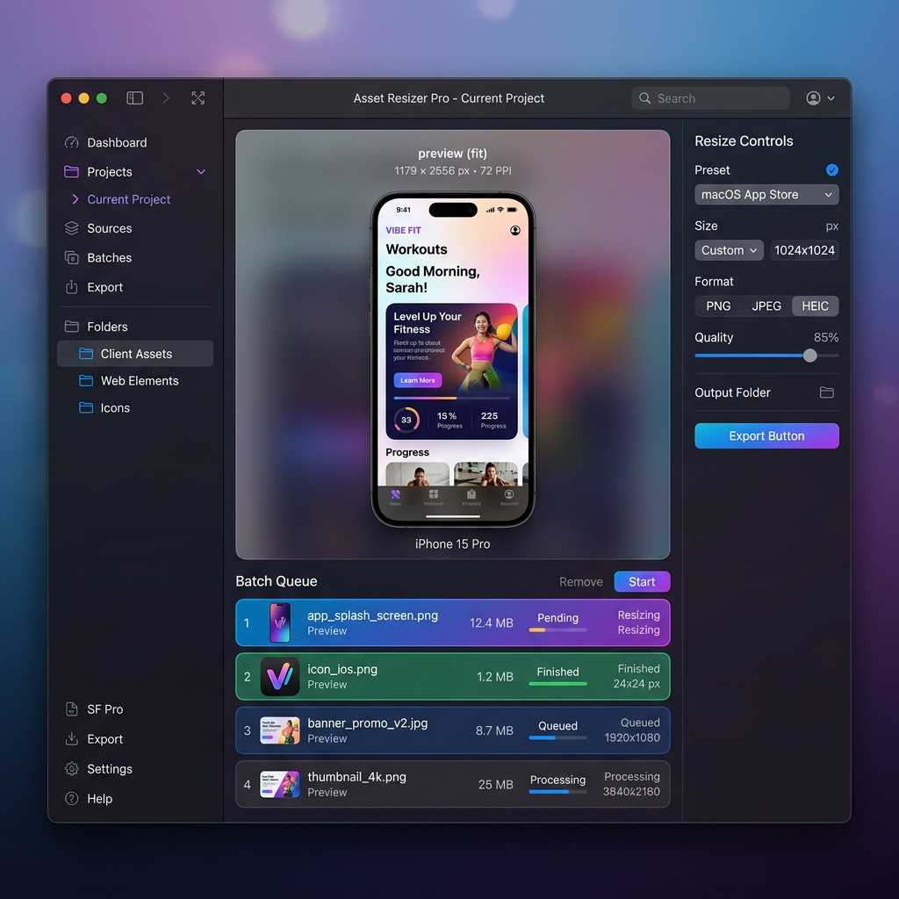

# 🖼️ Asset Resizer Pro

[](https://www.electronjs.org/)
[](https://vitejs.dev/)
[](https://reactjs.org/)
[](https://tailwindcss.com/)
[](LICENSE)

**Asset Resizer Pro** is a high-performance, professional-grade macOS application built for developers and designers who need to process thousands of images with precision. Whether you're preparing assets for the App Store, generating web thumbnails, or batch-renaming production content, Asset Resizer Pro provides a seamless, accelerated workflow.



---

## 🚀 Key Features

-   **⚡ High-Speed Batch Processing**: Process hundreds of images simultaneously using the power of the `Sharp` engine.
    -   **🎨 Real-Time Preview**: Instant high-fidelity previews with zoom and pan controls.
    -   **📱 Device Frames**: Automatically wrap your screenshots in professional device frames (iPhone, iPad, Mac).
    -   **🔍 Smart Scaling**: Choose between cover, contain, or custom scaling with sub-pixel precision.
    -   **🔧 Custom Templates**: Use powerful naming templates like `{filename}_{width}x{height}_{index}`.
    -   **🌓 Professional UI**: A stunning dark-mode interface built with Apple's design language in mind.
    -   **📂 Direct Export**: Save directly to your filesystem with organized folder structures.

---

## 🛠️ Tech Stack

-   **Core**: [Electron](https://www.electronjs.org/) (Desktop Container)
-   **Bundler**: [Vite](https://vitejs.dev/) (Rapid Development)
-   **Frontend**: [React](https://reactjs.org/) with [TypeScript](https://www.typescriptlang.org/)
-   **Styling**: [Tailwind CSS](https://tailwindcss.com/) & [Framer Motion](https://www.framer.com/motion/)
-   **Image Engine**: [Sharp](https://sharp.pixelplumbing.com/) (Node.js High-Performance Image Processing)
-   **State Management**: [Zustand](https://github.com/pmndrs/zustand)

---

## 📦 Installation & Setup

### Prerequisites
-   [Node.js](https://nodejs.org/) (v18 or higher)
-   [npm](https://www.npmjs.com/) or [yarn](https://yarnpkg.com/)

### Clone the Repository
```bash
git clone https://github.com/Qasimxlr/Images-resizzer.git
cd Images-resizzer
```

### Install Dependencies
```bash
npm install
```

### Development Mode
Runs the app with hot-reload in development.
```bash
npm run electron:dev
```

### Production Build
Builds the production-ready macOS app.
```bash
npm run electron:build
```

---

## 📖 Usage

1.  **Import**: Drag and drop images or use the import button.
2.  **Configure**: Select your preset (App Store, Android, Web) or set custom dimensions.
3.  **Adjust**: Use the interactive preview to zoom, pan, or adjust the fit of individual assets.
4.  **Rename**: Define your custom naming convention in the Renamer panel.
5.  **Export**: Select an output folder and hit "Export" to start the batch process.

---

## 🛡️ License

This project is licensed under the MIT License - see the [LICENSE](LICENSE) file for details.

---

<p align="center">
  Built with ❤️ for the Developer Community
</p>
